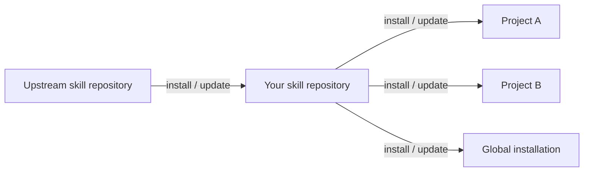

# skill-control

Install agent skills from Git and update them directly from their source repositories across your projects, preserving pins and local edits.

## Install the CLI

Requires Node.js 20 or later and Git. No Bun installation is required.

```sh
npm install --global @entroit/skill-control
```

## Install skills directly from GitHub

Run these commands in your project.

```sh
# Install Anthropic's frontend-design skill
sctl install https://github.com/anthropics/skills/tree/main/skills/frontend-design

# Preview changes published to the source repository
sctl update --check

# Pull source updates into all registered projects and global installations
sctl update

# Keep this project's skill at its current revision
sctl pin frontend-design
```

When the source skill changes, `sctl update` can update your installed copy. Pinned skills stay at their selected revision, and local edits block replacement.

Project skills live in `.agents/skills/`. Commit them with `skills.json` and `skills.lock.json` so contributors receive the same files. Links in `.claude/skills/` and `.codex/skills/` let those clients discover the same skills.

```sh
# Install for use across projects
sctl install https://github.com/anthropics/skills/tree/main/skills/frontend-design --global
```

## Share skills through your own repository



In your skill repository:

```sh
# Initialize skill management and create a group
sctl init
sctl group create frontend

# Import a skill and retain its upstream source
sctl install https://github.com/anthropics/skills/tree/main/skills/frontend-design --into frontend

# Pull upstream changes into your collection
sctl update

# Publish the updated collection through your usual Git workflow
git add .
git commit -m "Update frontend skills"
git push
```

In another project, replace `YOUR-USER/my-skills` with your repository:

```sh
# Install your published group
sctl install https://github.com/YOUR-USER/my-skills --group frontend

# Pull changes published to your skill repository
sctl update

# Restore this project's exact locked versions
sctl sync
```

Each installation updates from its recorded source. Projects that install your collection receive updates after you publish them to that repository.

## Inspect and manage installations

```sh
# Inspect sources, pins, and local edits
sctl status --json

# Allow a pinned skill to update again
sctl pin frontend-design --unpin

# Remove a skill from this project
sctl remove frontend-design

# Copy a project group to your machine-local global installation
sctl promote frontend --global

# Install that global group in another project
sctl install @global --group frontend
```

`update` includes managed Git worktrees, prunes missing installations, and continues after individual failures. `--check` previews changes without writing files. Commands report failures with a nonzero exit status.

`sync` restores exact locked versions in the selected installation. It does not advance source revisions, and local edits block replacement.

Changes remain ordinary working-tree changes. `sctl` never commits, pushes, or creates pull requests. An update can change skills used by agents working in other registered worktrees.

## Give your agent the commands

Ask your agent to run:

```sh
sctl skill
```

This prints the embedded [management skill](skills/skill-control/SKILL.md), so the agent can choose sources and scopes, inspect JSON results, and handle updates or conflicts. No separate management-skill installation is required.

## What to commit

Commit these files so contributors and agents get the same skills when they clone:

```text
skills.json                 Sources, selected skills, groups, and update policy
skills.lock.json            Exact revisions and content hashes
.agents/skills/              Installed skills and their supporting files
.claude/skills/              Client discovery links and managed attributes
.codex/skills/               Client discovery links and managed attributes
```

Do not ignore project skills. Keep the machine-local installation index out of Git. It lives at `~/.config/skillctl/installations.json`; global management files live under `~/.config/skillctl/global`. `XDG_CONFIG_HOME` changes the configuration directory, and `SCTL_HOME` selects an isolated state directory.

## Source limits

Skills must be self-contained. Imports reject symlinks and missing or external relative Markdown references. For GitHub branches containing `/`, use a repository URL with explicit `--ref` and `--path`. Local sources without a reproducible Git snapshot can be installed and updated, but `sync` cannot restore their exact snapshot.

## Contribute

Use Bun 1.4.2 and Git. [CONTRIBUTING.md](CONTRIBUTING.md) covers the pull-request workflow. [docs/features.md](docs/features.md) maps commands to their implementation, and [docs/bun.md](docs/bun.md) explains the runtime and npm distribution.

```sh
bun install --frozen-lockfile
bun run dev --help
bun run check
bun run build
./dist/sctl --help
```

## License

[MIT](LICENSE).
