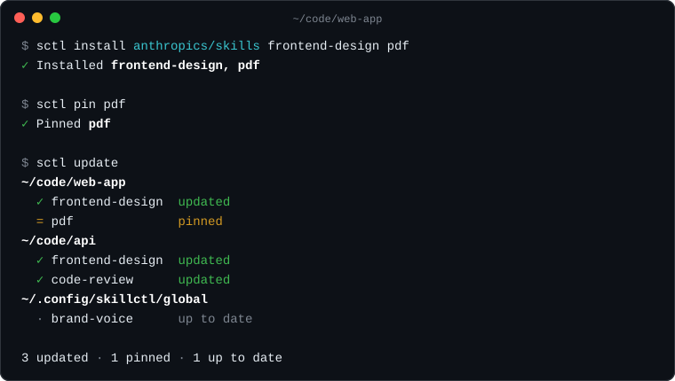
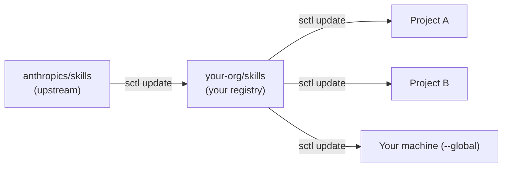

# skill-control

[](https://github.com/entroit/skill-control/actions/workflows/ci.yml)
[](LICENSE)

**Install agent skills from Git. Update them everywhere with one command.**

Copying a skill into a repository is easy. Keeping twenty copies current across your projects is the hard part. `sctl` remembers where each skill came from, then updates every project, worktree, and global installation on your machine from its source. Pinned skills hold still, and skills you edited stay as you left them.

<p align="center">
  
</p>

## Install

```sh
npm install --global @entroit/skill-control
```

You need Node.js 20 or later and Git. `sctl` ships as a native executable, so you do not need Bun.

## Use skills from any repository

Point `sctl` at a GitHub repository and name the skills you want:

```sh
sctl install anthropics/skills frontend-design pdf
```

That's it. The skills land in `.agents/skills/`, and links in `.claude/skills/` and `.codex/skills/` let Claude Code and Codex find them.

Later, when the source repository changes:

```sh
sctl update --check   # preview what would change
sctl update           # update every project and the global installation
```

Hold a skill at its current version with `sctl pin pdf`. Release it with `sctl pin pdf --unpin`.

If you leave out the skill names, `sctl` lists what the repository offers. Sources can also be a path inside a repository, a GitHub URL, any Git URL, or a local folder:

```sh
sctl install anthropics/skills/skills/pdf
sctl install https://github.com/anthropics/skills/tree/main/skills/pdf
sctl install git@gitlab.com:your-org/skills.git review
sctl install ./my-skills/review
```

Add `--global` to install a skill for every project on your machine.

## Share skills from your own repository

Teams usually want one place to curate skills: some copied from upstream, some written in-house. That place is an ordinary Git repository, and `sctl` manages it like any other project.



**In your registry**, import skills into named groups and publish with Git:

```sh
sctl install anthropics/skills frontend-design --into frontend
sctl group add frontend ./skills/design-review    # a skill you wrote
git add . && git commit -m "Add frontend skills" && git push
```

**In each project**, install a group or individual skills:

```sh
sctl install your-org/skills --group frontend
sctl install your-org/skills design-review
```

From then on, `sctl update` in your registry pulls upstream changes, and you review them in a normal diff. Once you push, `sctl update` in each project pulls your published version. Projects never jump past what you approved.

## What to commit

```text
skills.json          What you asked for: sources, skill names, groups
skills-lock.json     What you got: exact commits and content hashes
.agents/skills/      The skill files themselves
.claude/skills/      Links so Claude Code finds them
.codex/skills/       Links so Codex finds them
```

Commit all of it. A fresh clone works without network access to the sources, and `sctl sync` restores the exact locked versions. Here is a typical lock entry:

```json
"frontend-design": {
  "source": { "location": "https://github.com/anthropics/skills.git", "ref": "HEAD" },
  "sourcePath": "skills/frontend-design",
  "commit": "8a1541c4a3ffa5a20a5a91de0dcf3f0bab1d1ef4",
  "installedHash": "sha256:25f83c5f7a065e7e7010609456220a58125b13a261320c8f056a5bd9a8e13979"
}
```

`sctl` records each installation in `~/.config/skillctl/installations.json` so `update` can find it. That file is machine-local and stays out of Git.

## Commands

| Command | What it does |
| --- | --- |
| `sctl install <source> [skill...]` | Add skills from a repository, URL, or local path |
| `sctl update [--check]` | Pull source changes into every known installation |
| `sctl status` | Show each skill's source, commit, pin, and local edits |
| `sctl pin <skill> [--unpin]` | Hold a skill at its current version |
| `sctl remove <skill>` | Delete a managed skill |
| `sctl sync [--check]` | Restore the exact versions in `skills-lock.json` |
| `sctl group create\|add` | Build groups from skills you wrote |
| `sctl promote <group> --global` | Copy a project's group to your machine |

Add `--json` for machine-readable results. Run `sctl --help` for every option.

## Let your agent manage skills

Tell your coding agent to run:

```sh
sctl skill
```

It prints the [management skill](skills/skill-control/SKILL.md): when to use each command, how to read `--json` results, and how to resolve conflicts. You do not need to install it.

## What sctl will not do

- **Overwrite your edits.** A skill you changed locally blocks its update and shows up as a conflict.
- **Run skill code.** Installing or updating never executes scripts that ship with a skill.
- **Touch Git history.** Changes appear as ordinary working-tree edits. `sctl` never commits, pushes, or opens pull requests.
- **Stop at the first failure.** If one project fails to update, the rest still update, and the command exits nonzero.

Skills must be self-contained: `sctl` rejects symlinks and Markdown links that point outside the skill's folder.

## Contribute

[CONTRIBUTING.md](CONTRIBUTING.md) covers setup and the pull request workflow. [docs/features.md](docs/features.md) maps each behavior to its code and tests.

```sh
bun install --frozen-lockfile
bun run check
```

## License

[MIT](LICENSE)
